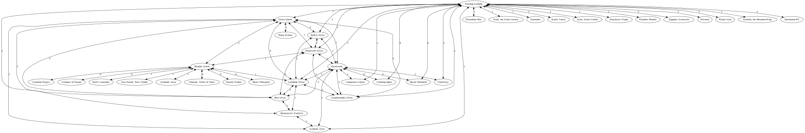

# Commander-Spellbook-Graph

This project takes the data from (Commander Spellbook)[https://commanderspellbook.com/] and graph it to show relationships between cards. If a card exists in a combo with another card, and edge is created between the cards. The weight of that edge is the number of combos both of those cards exist in.

This project requires [Python3](https://www.python.org/downloads/) and [GraphViz](https://graphviz.org/download/).

The project is currently set up for Visual Studio Code, but you can run it without an IDE like this:
```
python3 .\comboMapper.py
dot -Tsvg < combo.gv > combo.svg
```

The program downloads the JSON data each time it is run, but there's also a local copy of `values_batchGet.json` just in case.

As an example, here is a graph of cards that combo, starting with Sliver Queen:
